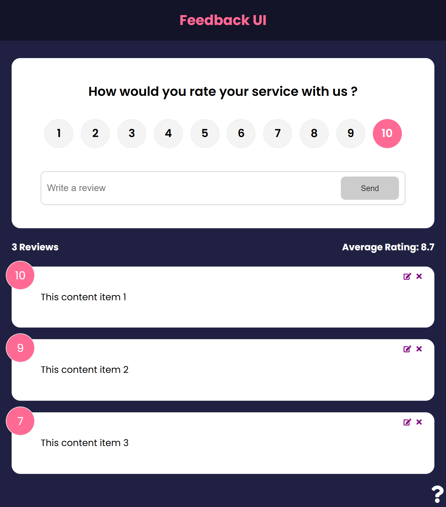

# Overview

Feedback App is a simple React application that allows users to add, update, and delete feedback. It provides an intuitive interface for users to share their thoughts and manage feedback efficiently.

## Features

- **Add Feedback**: Users can submit feedback with ease.
- **Update Feedback**: Modify existing feedback entries.
- **Delete Feedback**: Remove feedback when no longer needed.
- **Smooth UI Animations**: Integrated with Framer Motion for smooth transitions.
- **Client-Side Routing**: Implemented using React Router DOM.
- **Unique Identifiers**: Uses UUID to assign unique IDs to feedback entries.

### Screenshot



# Links

- Live Demo: [Coming Soon]
- Repository: [Coming Soon]

# Built with

- React
- React Router DOM
- Framer Motion
- UUID
- React Icons

## Installation

1. Clone the repository:
   ```sh
   git clone https://github.com/yourusername/feedback-app.git
   ```
